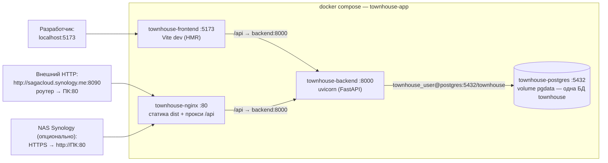
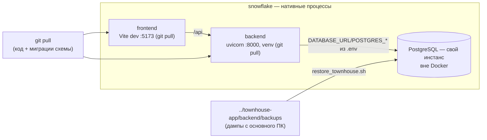

# Развёртывание Townhouse ERP

Документированный процесс установки/обновления окружения.
Принцип: **весь код и схема — только через git; настройки и секреты — только через `.env`.**

---

## 1. Переменные окружения (.env)

В корне репозитория скопируйте шаблон и заполните своими значениями:

```bash
cp .env.example .env
# отредактируйте .env: DATABASE_URL, AUTH_SECRET_KEY, CORS_ORIGINS, ...
```

- Никогда не коммитьте `.env` (он в `.gitignore`). Шаблон всех переменных — в `.env.example`.
- Пароль администратора передаётся через `ADMIN_PASSWORD` (или генерируется случайно) — см. `backend/create_user.py`.
- `create_user.py` **идемпотентен**: повторный запуск не ошибка — он обновляет пароль (и роль/имя)
  существующего пользователя на актуальный. Это удобно при многократном развёртывании.

---

## 2. Требования / предусловия

- **Python 3.11+** и доступ к **PostgreSQL**.
- **PostgreSQL должен быть запущен** и доступен по `DATABASE_URL` из `.env` (хост, порт, пользователь, пароль, имя БД). Проверка подключения — через SQLAlchemy (корректно при любом префиксе драйвера):
  ```bash
  python -c "import os;from dotenv import load_dotenv;load_dotenv();from sqlalchemy import create_engine;create_engine(os.getenv('DATABASE_URL')).connect().close();print('DB ok')"
  ```
  Если СУБД не запущена — запустите Postgres (или контейнер `docker run -d -e POSTGRES_USER=... -e POSTGRES_PASSWORD=... -e POSTGRES_DB=... -p 5432:5432 postgres:16`) и создайте базу.

> **Автоматическая сборка `DATABASE_URL`.** Если в `.env` не задан `DATABASE_URL`, строка
> подключения к Postgres собирается автоматически из `POSTGRES_HOST`/`POSTGRES_PORT`/
> `POSTGRES_USER`/`POSTGRES_PASSWORD`/`POSTGRES_DB` (см. `backend/database.py`). Поэтому
> достаточно задать либо `DATABASE_URL`, либо набор `POSTGRES_*` — дублировать не нужно.
- **Node 18+/npm** для фронтенда.

---

## 3. Установка «с нуля» (локальная разработка или новый VPS)

### 3.0. Новый VPS (чистый сервер) — автоматически

Для **нового** сервера (Ubuntu/Debian, ничего ещё не стоит) есть готовый скрипт
[`scripts/setup_vps.sh`](scripts/setup_vps.sh): он ставит системные пакеты, клонирует
репозиторий, делает venv/зависимости, `.env`, схему/справочники/админа, systemd-юнит
бэкенда и production-сборку фронтенда. Останется только nginx + DNS (подсказки скрипт
печатает в конце).

```bash
# на новом сервере, от root/sudo:
sudo bash -c 'curl -fsSL -o /tmp/setup_vps.sh https://raw.githubusercontent.com/Asagat/townhouse-app/main/scripts/setup_vps.sh && bash /tmp/setup_vps.sh'
# или — предварительно скопировать репо и:
bash scripts/setup_vps.sh
```

> Перед первым успешным прогоном отредактируйте созданный `.env` (БД, пароли, CORS).

### 3.1. Ручные действия — подробная инструкция (после установки на новом VPS)

После `setup_vps.sh` остаются шаги, которые нельзя автоматизировать полностью
(требуют вашего ввода: домен, реквизиты СУБД, DNS). По шагам:

#### 1) Создать базу данных и пользователя PostgreSQL

Если Postgres ещё не установлен/не создана база — выполните от root:

```bash
apt-get install -y postgresql
systemctl enable --now postgresql
```

Затем от пользователя `postgres` создайте роль и БД. Имена возьмите те же, что указаны
в `.env` (`POSTGRES_USER` / `POSTGRES_DB` / `POSTGRES_PASSWORD`):

```bash
sudo -u postgres psql <<'SQL'
CREATE USER townhouse_user WITH PASSWORD 'сложный-пароль';
-- ВАЖНО: DB должна быть UTF8, а НЕ SQL_ASCII (по умолчанию на кластере с локалью C).
-- При SQL_ASCII кириллица в справочниках/документах приведёт к
-- UnicodeEncodeError: 'ascii' codec can't encode ... при psycopg2.
CREATE DATABASE townhouse OWNER townhouse_user ENCODING 'UTF8' LC_COLLATE 'C.UTF-8' LC_CTYPE 'C.UTF-8' TEMPLATE template0;
SQL
```

Если база уже создана без `ENCODING 'UTF8'` (т.е. в `SQL_ASCII`) — кодировку БД нельзя изменить
на лету: пересоздайте её (данные тестовые можно сбросить):

```bash
sudo -u postgres psql <<'SQL'
DROP DATABASE IF EXISTS townhouse;
CREATE DATABASE townhouse OWNER townhouse_user ENCODING 'UTF8' LC_COLLATE 'C.UTF-8' LC_CTYPE 'C.UTF-8' TEMPLATE template0;
SQL
```

Проверка кодировки:
```bash
sudo -u postgres psql -d townhouse -c "SHOW server_encoding;"   # должно быть UTF8
```

Убедитесь, что в `.env` установлено:
```ini
POSTGRES_USER=townhouse_user
POSTGRES_PASSWORD=сложный-пароль
POSTGRES_DB=townhouse
POSTGRES_HOST=127.0.0.1   # или IP сервера БД
POSTGRES_PORT=5432
```

> Если строка `.env` задана через `DATABASE_URL=postgresql://...`, не дублируйте —
> хватает либо `DATABASE_URL`, либо набора `POSTGRES_*`.

#### 2) Проверить подключение к БД и повторно прогнать установку

Повторный запуск `setup_vps.sh` **идемпотентен** (не сломает готовые части):

```bash
bash scripts/setup_vps.sh
```

Он создаст схему (Alembic), справочники и админа, запустит systemd-юнит.

#### 3) Проверить, что бэкенд поднялся

```bash
systemctl status townhouse-backend
curl -s http://127.0.0.1:8000/openapi.json | head -c 200   # схема API (HTTP 200) — сервис поднялся

> Примечание: эндпоинта `/health` в коде нет — 404 на нём не является признаком проблемы.
```

Если сервис не встал — смотрите логи:
```bash
journalctl -u townhouse-backend -n 50 --no-pager
```

#### 4) Настроить nginx

Из шаблона `deploy/nginx.conf.template` создайте конфиг, заменив `__DOMAIN__`
и `__APP_DIR__`:

```bash
sed -e 's|__DOMAIN__|ваш-домен.example|' \
    -e 's|__APP_DIR__|/opt/townhouse|' \
    deploy/nginx.conf.template \
    > /etc/nginx/sites-available/townhouse

ln -s /etc/nginx/sites-available/townhouse /etc/nginx/sites-enabled/townhouse
nginx -t
systemctl reload nginx
```

Шаблон обрабатывает:
- `location /api/` → прокси на `127.0.0.1:8000` (бэкенд);
- `location /` → отдаёт статику SPA из `frontend/dist`;
- заголовки `X-Real-IP`/`X-Forwarded-*` для корректного логирования и CORS.

> В dev-режиме, если фронт на Vite (`:5173`), в шаблоне раскомментируйте
> `location / { proxy_pass http://127.0.0.1:5173; }` вместо статики.

#### 5) DNS-запись

На ваш DNS-провайдер добавьте A/AAAA-запись на домен сервера:

```text
<ваш-домен>.   IN   A   <IP-вашего-VPS>
```

Проверка:
```bash
dig <ваш-домен> +short
# должно вернуть IP сервера
```

#### 6) HTTPS (рекомендуется)

Установите TLS через Let's Encrypt / certbot:

```bash
apt-get install -y certbot python3-certbot-nginx
certbot --nginx -d <ваш-домен>
# certbot самостоятельно пропишет SSL в nginx и настроит продление
```

#### 7) Администратор и первичные данные

Администратор создаётся автоматически скриптом (`create_user.py`). Если нужно
обновить его пароль — повторно из `backend/`:

```bash
cd /opt/townhouse/backend
ADMIN_PASSWORD='новый-пароль' ../.venv/bin/python create_user.py
systemctl restart townhouse-backend
```

#### 8) Секреты и прод-безопасность

- `AUTH_SECRET_KEY` обязательно замените на случайный (лог предупредит, если не задан):
  ```bash
  python -c "import secrets; print(secrets.token_hex(32))"
  ```
- `CORS_ORIGINS` оставьте свой домен, уберите лишние `localhost`-значения при необходимости.
- Пароль админа / строка БД не должны попадать в git (`.env` — в `.gitignore`).

### 3.2. Ручная установка (без скриптов, как альтернатива)

Ключевой принцип: **инициализация схемы — только через Alembic** (`alembic upgrade head`).
Отдельный `bootstrap_db.py` (raw `create_all`) для развёртывания **не нужен** — вся схема
воспроизводится ревизиями Alembic (включая масштабирующую ревизию `0002_schema_squash`).

```bash
# 1) Python-зависимости в виртуальном окружении
python -m venv .venv
. .venv/bin/activate
pip install -r backend/requirements.txt

# 2) Перейти в каталог backend — ВСЕ команды ниже выполняются из него
cd backend

# 3) СХЕМА БД — только Alembic (создаёт все таблицы + users + alembic_version)
alembic upgrade head

# 4) Системные справочники (типы тарифов, услуги, тарифы по умолчанию) — идемпотентно
python init_data.py

# 5) Создать администратора (пароль из ADMIN_PASSWORD или будет сгенерирован)
python create_user.py

# 6) Запуск API (локальная разработка — с авто-перезагрузкой)
uvicorn app:app --host 0.0.0.0 --port 8000 --reload
```

> Скрипты бэкенда (`init_data.py`, `create_user.py`, `alembic`) выполняются строго из
> каталога `backend/` — так модули (`database`, `models`, `auth`) корректно попадают в
> `sys.path`. Отдельная передача `PYTHONPATH=backend` не требуется.
> `init_data.py` идемпотентен — создаёт только недостающие справочники.
> `create_user.py` создаёт пользователя, а при повторном запуске обновляет его пароль
> (идемпотентно); сгенерированный пароль печатается один раз в консоль.

---

## 4. Фронтенд

```bash
cd frontend
npm install
npm run dev          # dev-сервер на http://localhost:5173
```

- **`frontend/.env` создаётся автоматически**: скрипт `predev` (`ensure-env`) копирует
  `frontend/.env.example` в `frontend/.env`, если его ещё нет. Явно создавать `.env` не обязательно.
- **Dev-прокси по умолчанию**: `vite.config.ts` переадресует запросы `/api` на бэкенд
  (`VITE_PROXY_TARGET`, по умолчанию `http://localhost:8000`). Поэтому локально внешний
  адрес/CORS для бэкенда не нужны — фронтенд на :5173 сам проксирует запросы.
- Локальные переменные уточняйте в `frontend/.env`: `VITE_PROXY_TARGET`, `VITE_DEV_HOST=localhost`,
  `VITE_DEV_PORT`.

Production-сборка: `npm run build` (соберёт в `dist/`, статику отдаёт nginx).

---

## 5. Обновление уже развёрнутого окружения (VPS)

```bash
cd /opt/townhouse
git pull                       # забрать код и миграции
cd backend
alembic upgrade head            # применить новые миграции схемы
cd ..
# перезапустить сервис (см. пункт 7)
```

Новые файлы бэкенда используют установленные Python-зависимости; переустановка
`requirements.txt` нужна только если в нём изменились зависимости.

> **Рекомендуемый способ — скрипты (см. `scripts/`):**
>
> ```bash
> # Локальная разработка (venv, alembic, справочники, админ, uvicorn --reload):
> ./scripts/dev.sh
> # --full — дополнительно pip install по requirements.txt.
>
> # Обновление VPS (git pull, alembic, справочники, админ, restart сервиса):
> ./scripts/deploy_vps.sh
> ```
>
> Для надёжного запуска бэкенда на VPS используйте systemd-юнит
> `deploy/townhouse-backend.service` (управляет uvicorn без `--reload`):
>
> ```bash
> cp deploy/townhouse-backend.service /etc/systemd/system/
> systemctl daemon-reload
> systemctl enable --now townhouse-backend
> ```

> **Автоматизация:** проверки и выкат настраиваются через GitHub Actions —
> см. §10 (CI/CD: автопроверка и деплой). `scripts/deploy_vps.sh` дополнительно
> умеет выкатывать конкретную ветку/тег/SHA и пересобирает фронтенд.

---

## 6. Тесты

```bash
cd backend && python -m pytest tests/ -q   # тесты бэкенда
cd frontend && npx tsc --noEmit             # проверка типов фронтенда
```

---

## 7. Запуск через Docker (опционально)

В корне проекта есть `docker-compose.yml`:

```bash
docker compose up -d --build
```

- Сервисы: `postgres` (том `pgdata`), `backend`, `frontend` (dev-сервер Vite, проксирует `/api` на бэкенд через `VITE_PROXY_TARGET`), `nginx` (домашний вход, см. §7.1).
- Окружение backend собирается из корневого `.env` через `${VAR}` (`DATABASE_URL`, `AUTH_SECRET_KEY`, `CORS_ORIGINS`); контейнеру достаточно набора `POSTGRES_*` или готового `DATABASE_URL`.

На VPS (системный Postgres вместо контейнерного) сервис `postgres` можно отключить/удалить из compose — там БД внешняя.

Для продакшена бэкенд лучше запускать через systemd-юнит (uvicorn) + nginx,
а не dev-режимом.

### 7.1 Доступ из Интернета (домашний ПК)

Для домашнего ПК за роутером наружу выставляется только `nginx`-сервис (порт 80),
который отдаёт production-сборку фронтенда и проксирует `/api/` на backend:

```bash
docker compose exec -T frontend npm run build   # собрать frontend/dist (SPA)
docker compose up -d nginx
```

Конфиг — `deploy/nginx-home.conf` (server_name — ваш DDNS-домен).

На роутере: **DMZ выключить** и раздать порты явными правилами (на многих роутерах
DMZ перекрывает проброс). Пример для сети 192.168.50.0/24:

| Назначение | Внешний порт | Внутр. IP | Внутр. порт |
|---|---|---|---|
| Townhouse (HTTP) | 8090 | 192.168.50.101 | 80 |

На ПК открыть порт в файрволе: `sudo firewall-cmd --permanent --add-service=http` (+ `--reload`).
В `.env` в `CORS_ORIGINS` добавить внешний домен (`http://домен[:порт]`).

**HTTPS (по желанию) терминируется на NAS Synology** (сертификат DSM, продление — DSM):
в DSM «Обратный прокси» источник HTTPS на домен → назначение `http://192.168.50.101:80`.
Отдельный сертификат на ПК не нужен — nginx на ПК слушает только HTTP.

### 7.2 Схема потоков на домашнем ПК «corsus» (актуальное состояние)

> Машина `corsus` (Fedora Linux 44, desktop). Всё приложение крутится в Docker одним
> compose-проектом (`townhouse-app`); нативных сервисов (Postgres/nginx) на ПК нет.
> Контейнеры общаются между собой по именам сервисов (docker DNS), IP в сети
> `townhouse-app_default` (172.18.0.0/16) назначаются динамически.

**Контейнеры и порты:**

| Контейнер | Роль | Порт на хосте |
|---|---|---|
| `townhouse-nginx` | статика `frontend/dist` + прокси `/api` → backend | 80 (единственный внешний вход) |
| `townhouse-frontend` | dev-сервер Vite (HMR), прокси `/api` → backend | 5173 |
| `townhouse-backend` | FastAPI/uvicorn, единственный клиент БД | 8000 |
| `townhouse-postgres` | PostgreSQL 16, данные в volume `townhouse-app_pgdata` | 5432 (для pg_dump/psql с хоста) |

**Схема потоков:**



**Ключевые факты:**

- «Dev» (Vite на :5173) и «внешний» (nginx на :80) входы — **один и тот же**
  backend-контейнер и **одна общая БД**; отдельного dev/prod окружения нет.
- Фронтенд в БД напрямую не ходит — только backend. В `pg_stat_activity` видны
  подключения лишь с IP backend-контейнера.
- На хост проброшены порты 80/5173/8000/5432; наружу через роутер отдаётся только 80.
- HTTPS при необходимости терминируется на NAS Synology (сертификат DSM) — см. §7.1;
  на самом ПК nginx слушает только HTTP, сертификата на ПК нет.

### 7.3 ПК «snowflake» — локальный запуск + собственная БД (целевая схема)

> Договорённость для `snowflake`: фронтенд и бэкенд работают **локально** (не в Docker)
> и обновляются **из git** (код + миграции). БД — **отдельный инстанс PostgreSQL**
> (свой на snowflake), и она обновляется **импортом свежих дампов** из папки
> `../townhouse-app/backend/backups` (рабочая копия с основного ПК; каталог
> `backend/backups/` в git не коммитится, поэтому дампы передаются не через git).

**Схема потоков:**



**Настройка доступа на snowflake:**

- В корневом `.env` — подключение к **своей** БД: `POSTGRES_HOST=127.0.0.1`,
  `POSTGRES_PORT=5432`, свои `POSTGRES_USER`/`POSTGRES_PASSWORD`/`POSTGRES_DB`,
  плюс `AUTH_SECRET_KEY`/`CORS_ORIGINS`. База и роль создаются один раз
  в локальном Postgres на snowflake.
- Локальный запуск — как в §5/`scripts/dev.sh` (alembic + справочники + админ + uvicorn
  `--reload`); фронт — `cd frontend && npm run dev`.
- `scripts/restore_townhouse.sh` сам выбирает способ подключения: если compose-контейнера
  нет — работает через локальный `psql` (нужен установленный клиент).

**Ручное обновление БД из бэкапов (рекомендуемый порядок):**

```bash
# из корня проекта на snowflake; дампы берутся из рабочей копии основного ПК:
LATEST=$(ls -t ../townhouse-app/backend/backups/townhouse_*.sql | head -1)
ROLES=$(ls -t ../townhouse-app/backend/backups/townhouse_roles_*.sql | head -1)
./scripts/restore_townhouse.sh all --fresh "$LATEST" "$ROLES"
cd backend
alembic upgrade head    # если код новее дампа — догнать схему до head
python init_data.py      # справочники (идемпотентно)
python create_user.py    # админ (идемпотентно)
```

**Автоматизация «после git pull» (snowflake: Fedora, дампы через Synology Drive):**

1. В корневом `.env` на snowflake добавить включение зеркального режима:

   ```bash
   # Каталог с дампами основной копии (синхронизируется Synology Drive).
   DB_MIRROR_BACKUPS=../townhouse-app/backend/backups
   ```

2. Один раз установить git-hook:

   ```bash
   ./scripts/install_post_merge_hook.sh   # удалить: --remove
   ```

3. Теперь после каждого обычного `git pull` (merge) автоматически выполняется
   `scripts/update_db_after_pull.sh`:
   - всегда — догон схемы/справочников/админа (`alembic upgrade head` +
     `init_data.py` + `create_user.py`);
   - если в источнике появился дамп **новее** применённого (маркер
     `.git/db_refresh.state`) — полная пересборка БД из дампа
     (`restore_townhouse.sh all --fresh --yes`) с последующим догоном схемы.

   Лог запусков — `.git/post-merge.log`. Вручную можно запустить
   `./scripts/refresh_from_backups.sh [--yes|--dry-run]`.

Примечания:
- Машина без `DB_MIRROR_BACKUPS` в `.env` — не зеркальная: скрипты молча ничего
  не делают (например, VPS или corsus без симметричного режима §7.4).
- Автоимпорт **деструктивен** (drop/create БД) и поэтому включается только
  явной переменной `DB_MIRROR_BACKUPS` и только при появлении дампа новее маркера.
- `git pull --rebase` hook **не** запускает — используйте обычный `git pull`.

### 7.4 Симметричный режим: corsus ↔ snowflake (разработка по очереди)

> Идея: разрабатывать можно на любом из двух ПК, но одновременно пишет в БД
> только один — «активный». Второй ПК работает зеркалом: код догоняет из git,
> данные — импортом свежих дампов (однонаправленно в момент переключения).

**Подготовка обеих машин (по одному разу):**

- corsus (docker-стек): в корневом `.env` включить зеркальный режим и поставить hook:

  ```bash
  # .env на corsus
  DB_MIRROR_BACKUPS=backend/backups
  ```

  ```bash
  ./scripts/install_post_merge_hook.sh
  ```

- snowflake — как в §7.3 (`DB_MIRROR_BACKUPS=../townhouse-app/backend/backups` + тот же hook).

Дополнительно на обеих машинах ставится hook **автодампа перед push** (кто пушит —
тот и выгружает дамп):

```bash
./scripts/install_pre_push_hook.sh   # удалить: --remove
```

**Цикл работы (по очереди):**

1. Активный ПК в конце сеанса выгружает состояние БД. Автоматически — при
   `git push` (hook `pre-push` запускает `dump_to_sync.sh`), либо вручную, если
   менялись только данные и пуша не будет:
   `./scripts/dump_to_sync.sh` — кладёт `townhouse_<stamp>.sql` (+ роли) в
   синхронизируемую папку (Synology Drive) и ставит маркер `.git/db_refresh.state`
   («локальная БД уже соответствует этому дампу» — свой дамп повторно не импортируется).
   Сбой дампа push НЕ блокирует (только предупреждение в `.git/pre-push.log`).
2. Synology Drive доставляет дамп на второй ПК.
3. Второй ПК делает обычный `git pull` → hook запускает `update_db_after_pull.sh`:
   догон схемы (на corsus — в backend-контейнере, на snowflake — через `.venv`),
   затем импорт дампа (`restore_townhouse.sh all --fresh --yes`) и повторный догон схемы.

Импорт срабатывает, когда самый свежий дамп **отличается от маркера**; одинаковый —
пропускается. Автоимпорт деструктивен (drop/create БД) — на зеркале это норма, но перед
переключением не забудьте выгрузить свой дамп (`dump_to_sync.sh`).

### 7.5 Пошаговая подготовка машины к автообновлению БД

**Общие предусловия (обе машины):**

- один git-клон проекта (remote `git@github.com:Asagat/townhouse-app.git`), обновление —
  только обычным `git pull` (hook не срабатывает на `git pull --rebase`);
- корневой `.env` с секретами и `POSTGRES_*`;
- в `.env` задана `DB_MIRROR_BACKUPS` — папка, синхронизируемая Synology Drive в обе стороны;
- установлен hook `post-merge`;
- в момент `git pull` целевая БД доступна.

**Шаг 1. Общее (выполнить на обеих машинах):**

```bash
# .env — добавить строку (значение — см. Шаг 2/3 для своей машины)
# DB_MIRROR_BACKUPS=...

# hook — один раз в каждом клоне
./scripts/install_post_merge_hook.sh
# автодамп БД перед push (кто пушит — тот выгружает дамп)
./scripts/install_pre_push_hook.sh
```

**Шаг 2. corsus (docker-стек):**

```bash
# .env
DB_MIRROR_BACKUPS=backend/backups

# контейнеры должны быть подняты в момент pull (импорт идёт через docker):
docker compose up -d postgres backend
```

Больше ничего не нужно: схема гоняется в backend-контейнере, импорт — через
`townhouse-postgres`; локальный psql не требуется.

**Шаг 3. snowflake (Fedora, нативный запуск):**

```bash
# 3.1 системные пакеты и PostgreSQL
sudo dnf install -y git python3 python3-pip nodejs npm postgresql-server postgresql
sudo postgresql-setup --initdb          # только при первом запуске
sudo systemctl enable --now postgresql

# 3.2 раскладка папок: рабочий git-клон НЕ должен совпадать с синхронизируемой папкой.
#     Пример: ~/projects/townhouse-app — синхронизируемая папка (Synology Drive, дампы),
#     ~/projects/townhouse-dev — рабочий клон. Тогда ../townhouse-app/backend/backups
#     из клона указывает на синхронизируемую папку.
git clone git@github.com:Asagat/townhouse-app.git ~/projects/townhouse-dev
cd ~/projects/townhouse-dev

# 3.3 роль и БД (имена/пароль — как в .env)
sudo -u postgres psql -c "CREATE ROLE townhouse_user LOGIN PASSWORD '...' CREATEDB SUPERUSER;"
sudo -u postgres psql -c "CREATE DATABASE townhouse OWNER townhouse_user;"

# 3.4 окружение бэкенда
python3 -m venv .venv
.venv/bin/pip install -r backend/requirements.txt

# 3.5 .env: cp .env.example .env и заполнить (POSTGRES_HOST=127.0.0.1, POSTGRES_PORT=5432,
#     свои POSTGRES_USER/PASSWORD/DB, ADMIN_*, AUTH_SECRET_KEY, CORS_ORIGINS) + строка:
#     DB_MIRROR_BACKUPS=../townhouse-app/backend/backups

# 3.6 hook
./scripts/install_post_merge_hook.sh
```

Права роли: `CREATEDB` обязателен (`restore --fresh` делает drop/create БД); `SUPERUSER`
нужен только чтобы выгружать роли (`pg_dumpall --roles-only`) — без него роли просто не
снимутся, это не критично (на docker-БД пользователь и так создаётся из `.env`).

**Шаг 4. Первый импорт (сразу из дампа, не «пустая БД»):**

```bash
./scripts/update_db_after_pull.sh      # или вручную: ./scripts/refresh_from_backups.sh --yes
```

Если дампы ещё не досинхронизировались — скрипт молча подождёт (это нормально).

**Шаг 5. Проверка (на любой машине):**

```bash
./scripts/update_db_after_pull.sh
```

Ожидания: `alembic upgrade head` без изменений, `init_data`/`create_user` отработали,
refresh сообщает «дамп уже применён / новых нет» либо импортирует новый дамп.
Лог каждого запуска hook — `.git/post-merge.log`.

**Частые проблемы:**

| Симптом | Причина / решение |
|---|---|
| «Нет .venv и нет backend-контейнера…» | На corsus подняты не все контейнеры: `docker compose up -d postgres backend`. На snowflake нет venv: `python3 -m venv .venv` + pip install |
| «Каталог дампов не найден…» | Synology Drive ещё не синхронизировал папку — проверить клиент/папку, повторить pull |
| «Новых дампов нет» при свежем дампе на другом ПК | Дамп ещё не досинхронизировался или вы уже применяли его; подождать/проверить `ls` папки |
| Автоимпорт не запускается после `git pull --rebase` | Использовать обычный `git pull` |
| После pull БД «откатилась» на старый дамп | Активный ПК не сделал `dump_to_sync.sh` перед переключением — см. §7.4 |

---

## 8. Резервное копирование БД (дамп)

Дамп PostgreSQL хранится в **корне проекта** как файл `townhouse_db.sql.gz` (удобно для переноса локаль↔VPS).
Данные (включая чувствительные) **в git не коммитятся** (см. `.gitignore`).

Создать дамп (используется DATABASE_URL из `.env`):

```bash
.venv/bin/python -c "from dotenv import load_dotenv;load_dotenv();import os;print(os.getenv('DATABASE_URL'))"
# затем:
pg_dump "$DATABASE_URL" | gzip > townhouse_db.sql.gz
```

> Если `pg_dump`/`psql` недоступны в PATH, их можно взять из контейнера `postgres`:
> `docker exec -i <pg-container> pg_dump -U townhouse_user -d townhouse -Fc - | cat > townhouse_db.dump`.
> Точные значения VARS удобно считывать через `DATABASE_URL` из `.env`.

### 8.1 Дамп штатного состояния (полный + роли) для переноса на другой ПК

Для копии проекта на другой машине снимите **полный plain-SQL дамп данных** и отдельно **роли/пользователей**:

```bash
cd townhouse-app
mkdir -p backend/backups
STAMP=$(date +%Y%m%d_%H%M%S)

# (а) полный дамп БД townhouse: схема + данные, без владельцев/привилегий
docker exec townhouse-postgres sh -c \
  'PGPASSWORD=... pg_dump -U townhouse_user -d townhouse --no-owner --no-privileges' \
  > "backend/backups/townhouse_${STAMP}.sql"

# (б) роли/пользователи кластера (отдельно от данных)
docker exec townhouse-postgres sh -c \
  'PGPASSWORD=... pg_dumpall --roles-only -U townhouse_user' \
  > "backend/backups/townhouse_roles_${STAMP}.sql"
```

На каждом ПК забираете вместе: и сам проект (`townhouse-app/`), и эти два файла.

### 8.2 Восстановление БД

Есть готовый скрипт: **`scripts/restore_townhouse.sh`** (параметры подключения берёт из `.env`). Убедитесь, что postgres-контейнер запущен (`docker compose ps postgres`).

```bash
# поднять сервисы (если не подняты)
docker compose up -d postgres backend frontend

# (1) восстановить данные (пример: --fresh стирает и пересоздаёт DB)
./scripts/restore_townhouse.sh data --fresh backend/backups/townhouse_YYYYMMDD_HHMMSS.sql

# (2) применить роли/пользователей (первый запуск на новом сервере / если юзер отсутствует)
./scripts/restore_townhouse.sh roles backend/backups/townhouse_roles_YYYYMMDD_HHMMSS.sql
#    ВАЖНО: на Docker-базе, где пользователь уже создан при старте из .env, роли можно НЕ применять,
#    либо использовать --force, чтобы пересоздать роли из дампа.

# (3) перезапустить приложение, чтобы оно подключилось к восстановленным данным
docker restart townhouse-backend townhouse-frontend
```

Вручную то же самое (без скрипта):

```bash
# пересоздать чистую DB и залить
PGPASSWORD=... docker exec -i townhouse-postgres psql -U townhouse_user -d postgres -v ON_ERROR_STOP=1 \
  -c 'DROP DATABASE IF EXISTS townhouse' -c 'CREATE DATABASE townhouse OWNER townhouse_user'
PGPASSWORD=... docker exec -i townhouse-postgres psql -U townhouse_user -d townhouse -v ON_ERROR_STOP=1 \
  < backend/backups/townhouse_YYYYMMDD_HHMMSS.sql
# роли (одноразово) при необходимости
PGPASSWORD=... docker exec -i townhouse-postgres psql -U townhouse_user -d postgres \
  < backend/backups/townhouse_roles_YYYYMMDD_HHMMSS.sql
```

**Замечания:**
- Датамп содержит схему (`CREATE TABLE`) и **не удаляет** существующие объекты — поэтому восстановление лучше делать в **свежую/пересозданную** БД (см. `--fresh`), иначе возможны конфликты существующих таблиц.
- Перед `DROP DATABASE` остановите или отключите backend, иначе сессия удержит базу (скрипт сам гасит активные сессии).
- Дампы `backend/backups/townhouse_*.sql` — рабочие, актуальные снимки; при желании добавьте их паттерн в `.gitignore` (данные чувствительны).

---

## 9. Ключевые команды / скрипты

| Команда (из каталога backend) | Назначение |
|---|---|
| `alembic upgrade head` | Применить миграции Alembic (создание всей схемы с нуля — единственный канал) |
| `python init_data.py` | Системные справочники (типы тарифов, услуги, тарифы) — идемпотентно |
| `python create_user.py` | Создать/обновить пользователя (пароль из env/случайный; повторный запуск обновляет пароль) |
| `python bootstrap_db.py` | **Только отладочный fallback** (raw `create_all`). Для развёртывания не нужен. |
| `python -m pytest tests/ -q` | Запустить тесты бэкенда |
| `uvicorn app:app --host 0.0.0.0 --port 8000` | Запустить API |
| `npm run dev` (в `frontend/`) | Dev-сервер Vite (автосоздаёт `frontend/.env`, проксирует `/api`) |
| `./scripts/dev.sh` | Локальное развёртывание + запуск uvicorn (`--full` — pip install) |
| `./scripts/setup_vps.sh` | Полная установка на НОВОМ VPS (пакеты, clone, .env, БД, systemd, build) |
| `./scripts/deploy_vps.sh [ref]` | Обновление VPS (fetch, при `ref` — фиксация ветки/тега/SHA, alembic, справочники, админ, сборка фронтенда, restart). Без аргумента — авто-выкат `git pull` (main); вызывается из GitHub Actions (см. §10) |
| `./scripts/restore_townhouse.sh` | Восстановление БД из дампов (см. §8.2): `data [--fresh] <файл.sql>`, `roles [--force] <файл.sql>`, `all ...`; `--yes` — без запроса (для автоматизации) |
| `./scripts/refresh_from_backups.sh [--yes]` | Зеркальный ПК: импорт свежих дампов из `DB_MIRROR_BACKUPS` + догон схемы (маркер `.git/db_refresh.state`) |
| `./scripts/update_db_after_pull.sh` | После `git pull`: догон схемы + зеркальные дампы (вызывается hook-ом post-merge) |
| `./scripts/dump_to_sync.sh` | Активный ПК: выгрузить дамп БД в синхронизируемую папку (`DB_MIRROR_BACKUPS`) и обновить маркер |
| `./scripts/install_post_merge_hook.sh` | Установить/удалить git-hook `post-merge` (автозапуск после pull) |
| `./scripts/install_pre_push_hook.sh` | Установить/удалить git-hook `pre-push` (автодамп БД перед push) |

---

## 10. CI/CD: автопроверка и деплой (GitHub Actions)

> Задача 3.3 роадмапа. Код, успешно прошедший все проверки, автоматически
> подготавливается к релизу (docker-образы, релизный тег) или выкатывается на
> сервер. Ветка main — git-центричная модель: прод = проверенный CI коммит в main.

### 10.1 Что в репозитории

| Файл | Что делает |
|---|---|
| `.github/workflows/ci.yml` | Автопроверка на push/PR в `main`. Job `backend`: disposable-сервис `postgres:16` → `alembic upgrade head` → `init_data.py` → `python -m pytest tests/ -q` (`DATABASE_URL` и `AUTH_SECRET_KEY` задаются на job). Job `frontend`: `npm ci` → `npm run build` (= tsc + vite).
| `.github/workflows/docker-build.yml` | Авто-сборка и публикация docker-образов (`backend/Dockerfile`, `frontend/Dockerfile`) в `ghcr.io/asagat/townhouse-app-{backend,frontend}`: push в `main` → тег `main`; релизный тег `v*` → semver-теги (`v1.2.3`, `1.2`); можно запустить вручную. Образы — для docker-compose-установок (домашние ПК и т.п.).
| `.github/workflows/deploy.yml` + `.github/actions/deploy/` | Выкат на сервер по SSH: вручную (окружение `staging`/`production` + ref) или автоматически по релизному тегу `v*` → `production`. На сервере выполняется `scripts/deploy_vps.sh <ref>`. Деплой разрешён только если для коммита есть **успешный** прогон CI (проверка в action).

На сервере `scripts/deploy_vps.sh <ref>` делает: `git fetch` + фиксация кода на `ref` (workflow передаёт **SHA проверенного CI коммита**) → `alembic upgrade head` → `init_data.py` → `create_user.py` → **сборка фронтенда** (`npm ci`/`npm install` → `npm run build`; статика в `frontend/dist`, её отдаёт nginx) → перезапуск systemd-сервиса `townhouse-backend`.

### 10.2 Настройка (один раз)

1. **SSH-доступ с GitHub до сервера.** Сгенерируйте deploy-ключ (без passphrase):

   ```bash
   ssh-keygen -t ed25519 -C "github-actions-deploy" -f ~/.ssh/townhouse_deploy -N ""
   # публичную часть добавить на сервер в ~/.ssh/authorized_keys пользователя,
   # под которым идёт деплой (обычно root):
   #   ssh-copy-id -i ~/.ssh/townhouse_deploy.pub root@SERVER
   ```

2. **Секреты в GitHub** (Settings → Secrets and variables → Actions). Имена общие для
   окружений (см. п. 3) — у каждого окружения свои значения:

   | Секрет | Значение |
   |---|---|
   | `SSH_HOST` | домен/IP сервера |
   | `SSH_USER` | пользователь SSH (обычно `root`) |
   | `SSH_KEY` | приватный ключ `~/.ssh/townhouse_deploy` (целиком, с `-----BEGIN ...-----`) |
   | `APP_DIR` | каталог проекта на сервере (по умолчанию `/opt/townhouse`, секрет можно не задавать) |

3. **Окружения** (Settings → Environments): создайте `staging` и `production` и
   положите в каждое свои секреты `SSH_HOST`/`SSH_USER`/`SSH_KEY` (один и тот же
   сервер может использоваться и как staging). Для `production` можно включить
   **required reviewers** — ручное подтверждение выката.

4. **Branch protection** для `main`: отметьте job'ы CI (`CI / Backend …`,
   `CI / Frontend …`) как required checks — тогда в main не попадёт код без зелёного CI.

5. **Пакеты ghcr.io** публикуются токеном `GITHUB_TOKEN` — отдельной настройки не требуют.

### 10.3 Сценарии

**Выкат main на тестовый сервер (staging).** Actions → *Deploy* → *Run workflow*:
`environment: staging`, `ref: main`. Сервер получит код main, CI для коммита зелёный
(проверяется автоматически), БД мигрирует, фронтенд пересоберётся.

**Релиз и выкат на прод.** На проверенном коммите main создайте релизный тег:

```bash
git tag v1.2.3 && git push origin v1.2.3
```

Тег запускает публикацию docker-образов с semver-тегами и **автоматический деплой на
`production`**. Деплой-гейт проверяет, что для коммита тега есть успешный прогон CI —
он был при пуше этого коммита в `main`. Если для окружения `production` настроены
required reviewers — потребуется ручное подтверждение.

**Ручной выкат на прод** (без тега): Actions → *Deploy* → `environment: production`,
`ref: main`.

> Чтобы временно выкатить на staging код без успешного CI (эксперименты), включите
> `allow_untested` в форме запуска workflow — на `production` это не действует.

### 10.4 Тестовый сервер для сверки данных

Для сверки данных (импортированная история, контрольные суммы) поднимите **отдельный
сервер/ПК** по инструкции §3 (`scripts/setup_vps.sh`): своя БД, свой домен/URL, свой
`.env` с `CORS_ORIGINS`. Деплой на него — то же окружение `staging` (см. 10.3).
Тест-сверка с файлом-источником (`backend/tests/test_control_sums_vs_source.py`,
`templates/Миграция данных FTH.xlsx`) сработает именно на такой БД с импортированной
историей; на пустой/свежей БД (в т.ч. disposable-БД CI) набор пропускается, чтобы
CI оставался зелёным.

### 10.5 Примечания

- `scripts/deploy_vps.sh` без аргумента делает `git pull` (авто-выкат main). После
  деплоя **по тегу/SHA** репозиторий на сервере остаётся в detached HEAD — вернитесь
  на main: `git checkout -f main && ./scripts/deploy_vps.sh`. При выкате ветки вручную
  (`./scripts/deploy_vps.sh <ветка>`) сервер переходит на неё и фиксируется на
  `origin/<ветка>`. Workflow деплоя всегда выкатывает конкретный проверенный SHA
  (не имя ветки), поэтому состояние сервера детерминировано.
- Фронтенд пересобирается при **каждом** деплое (сборка в `dist.tmp` + атомарная
  замена `dist`): раньше обновление через `deploy_vps.sh` не обновляло статику,
  которую отдаёт nginx.
- Тесты в CI идут против **отдельной disposable-БД** (`postgres:16`), никак не
  связанной с живыми данными (см. `conftest.py`: автоочистка тестовых сущностей;
  задачу ТД-3 роадмапа).
